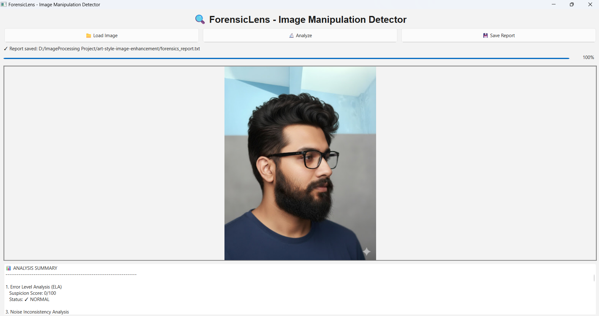

# 🔍 ForensicLens - Image Manipulation Detector

<p align="center">
  
</p>

<p align="center">
  <strong>A comprehensive digital forensics tool for detecting image manipulation using classical image processing techniques</strong>
</p>

<p align="center">
  <a href="#features">Features</a> •
  <a href="#techniques">Techniques</a> •
  <a href="#installation">Installation</a> •
  <a href="#usage">Usage</a> •
  <a href="#project-structure">Structure</a> •
  <a href="#how-it-works">How It Works</a>
</p>

---

## 📋 Overview

ForensicLens is an advanced image forensics application that detects digital manipulation, forgery, and editing in images using **classical image processing techniques** without relying on deep learning or AI models. The tool implements multiple forensic analysis methods to provide comprehensive detection of various manipulation types.

### 🎯 Purpose

In an era of widespread digital manipulation and deepfakes, ForensicLens serves as an educational and practical tool for:
- **Digital Forensics Investigators** - Detecting tampered evidence
- **Journalists** - Verifying image authenticity
- **Researchers** - Studying image manipulation techniques
- **Students** - Learning image processing and forensics

---

## ✨ Features

### Core Detection Capabilities

| Feature | Description |
|---------|-------------|
| 🔍 **Error Level Analysis (ELA)** | Detects JPEG compression inconsistencies |
| 🌊 **Noise Pattern Analysis** | Identifies spliced regions via noise inconsistencies |
| 📊 **Histogram Forensics** | Detects contrast enhancement and equalization |
| 🎨 **Bit-Depth Analysis** | Finds posterization and color reduction artifacts |
| 🔄 **Clone Detection** | Discovers copy-move forgery and duplicated regions |
| 📡 **Frequency Analysis** | Analyzes FFT spectrum for periodic patterns |
| 🌓 **Contrast Analysis** | Detects localized contrast manipulations |
| 🌫️ **Blur Analysis** | Identifies inconsistent blur and motion artifacts |
| 💡 **Lighting Analysis** | Finds unnatural illumination patterns |

### User Interface Features

- **Intuitive GUI** - Simple drag-and-drop interface
- **Real-time Analysis** - Progress tracking with visual feedback
- **Comprehensive Reports** - Detailed forensics reports with suspicion scores
- **Visual Heatmaps** - Color-coded visualization of suspicious regions
- **Export Capabilities** - Save reports as `forensics_report.txt` and analysis heatmaps

---

## 🔬 Image Processing Techniques Implemented

This project demonstrates practical implementation of the following image processing concepts:

### 1. Histogram-Based Techniques
- **Histogram Equalization Detection** - Identifies contrast enhancement artifacts
- **Histogram Clipping Analysis** - Detects tone mapping and dynamic range manipulation
- **Statistical Distribution Analysis** - Examines pixel intensity distributions

### 2. Noise Analysis
- **Gaussian Noise Estimation** - Measures sensor noise patterns
- **Poisson Noise Detection** - Analyzes photon shot noise
- **Noise Variance Mapping** - Creates spatial noise consistency maps

### 3. Frequency Domain Analysis
- **Fast Fourier Transform (FFT)** - Analyzes frequency components
- **Notch Filter Application** - Detects and removes periodic patterns
- **Spectral Analysis** - Identifies compression artifacts

### 4. Compression Artifacts
- **JPEG Error Level Analysis** - Detects re-compression traces
- **DCT Coefficient Analysis** - Examines discrete cosine transform patterns
- **Quantization Artifacts** - Finds compression inconsistencies

### 5. Spatial Analysis
- **Region Descriptors** - Segments image into analyzable blocks
- **Block Matching** - Finds duplicated regions (clone detection)
- **Correlation Analysis** - Measures region similarity

### 6. Edge and Blur Detection
- **Laplacian Variance** - Measures image sharpness
- **Motion Blur Detection** - Identifies directional blur patterns
- **Edge Consistency** - Analyzes edge sharpness variations

### 7. Lighting and Color
- **Bias Field Estimation** - Models lighting gradients
- **Bit-Depth Reduction** - Detects color quantization
- **Contrast Shift Detection** - Finds localized brightness adjustments

---

## 🛠️ Installation

### Prerequisites

- Python 3.11+ (or Python 3.13 with compatible packages)
- pip package manager
- Windows/Linux/macOS

### Step 1: Clone the Repository

```bash
git clone https://github.com/yourusername/forensiclens.git
cd forensiclens
```

### Step 2: Create Virtual Environment

```bash
# Create virtual environment
python -m venv venv

# Activate virtual environment
# On Windows PowerShell:
.\venv\Scripts\Activate.ps1

# On Windows CMD:
.\venv\Scripts\activate.bat

# On Linux/Mac:
source venv/bin/activate
```

### Step 3: Install Dependencies

```bash
# Upgrade pip
python -m pip install --upgrade pip

# Install required packages
pip install -r requirements.txt
```

### requirements.txt
```txt
opencv-python>=4.8.0
numpy>=1.26.0
PyQt6>=6.5.0
scipy>=1.11.0
scikit-image>=0.22.0
matplotlib>=3.8.0
Pillow>=10.0.0
```

---

## 🚀 Usage

### Running the Application

```bash
# Make sure virtual environment is activated
python main.py
```

### Basic Workflow

1. **Load Image** - Click "📁 Load Image" and select an image file (JPG, PNG, BMP)
2. **Analyze** - Click "🔬 Analyze" to run all 9 forensic tests
3. **View Results** - Review the comprehensive analysis report with suspicion scores
4. **Save Report** - Click "💾 Save Report" to export findings as `forensics_report.txt`

### Output Files

After analysis, the following files are automatically generated:

```
samples/output/
├── ela_heatmap.png          # Error Level Analysis visualization
├── noise_heatmap.png        # Noise inconsistency map
├── frequency_spectrum.png   # FFT frequency analysis
├── contrast_map.png         # Contrast distribution
└── forensics_report.txt     # Complete text report
```

The main report (`forensics_report.txt`) can also be saved to any location via the GUI.

### Testing with Sample Images

```bash
# Place test images in samples/ directory
samples/
├── original.jpg        # Unmodified image
├── edited.jpg          # Manipulated image
└── output/            # Analysis results will be saved here
```

---

## 📁 Project Structure

```
forensiclens/
│
├── main.py                          # Main GUI application
├── requirements.txt                 # Python dependencies
├── README.md                        # Project documentation
├── forensics_report.txt             # Sample/Latest generated report
│
├── images/
│   └── project.png                  # Screenshot for documentation
│
├── utils/                           # Utility modules
│   ├── __init__.py
│   ├── image_loader.py              # Image loading and preprocessing
│   ├── visualization.py             # Heatmap and plot generation
│   └── report_generator.py          # Forensics report creation
│
├── modules/                         # Forensic analysis modules
│   ├── __init__.py
│   ├── histogram_analysis.py        # Histogram manipulation detection
│   ├── error_level_analysis.py      # ELA implementation
│   ├── noise_analysis.py            # Noise inconsistency detection
│   ├── bit_depth_analysis.py        # Bit-depth and posterization
│   ├── clone_detection.py           # Copy-move forgery detection
│   ├── frequency_analysis.py        # FFT and notch filter
│   ├── contrast_analysis.py         # Contrast manipulation
│   ├── blur_analysis.py             # Blur inconsistency detection
│   └── bias_field_analysis.py       # Lighting analysis
│
└── samples/                         # Test images and outputs
    ├── original.jpg
    ├── edited.jpg
    └── output/                      # Generated analysis results
        ├── ela_heatmap.png
        ├── noise_map.png
        └── forensics_report.txt
```

---

## 🔍 How It Works

### Analysis Pipeline

```
┌─────────────────────────────────────────────────────────────────┐
│                         Load Image                               │
└────────────────────────┬────────────────────────────────────────┘
                         │
                         ▼
┌─────────────────────────────────────────────────────────────────┐
│                    Preprocessing                                 │
│  • Format conversion (RGB/Grayscale)                            │
│  • Resolution normalization                                      │
│  • Initial validation                                            │
└────────────────────────┬────────────────────────────────────────┘
                         │
                         ▼
        ┌────────────────┴────────────────┐
        │    9 Parallel Analysis Modules   │
        └─────────────┬───────────────────┘
                      │
        ┌─────────────┼─────────────┐
        │             │             │
        ▼             ▼             ▼
┌──────────────┐ ┌──────────────┐ ┌──────────────┐
│ Histogram    │ │ Noise        │ │ Frequency    │
│ Analysis     │ │ Analysis     │ │ Analysis     │
└──────┬───────┘ └──────┬───────┘ └──────┬───────┘
       │                │                │
       └────────────────┼────────────────┘
                        ▼
              ┌─────────────────────┐
              │  Results Aggregation │
              └──────────┬───────────┘
                         │
                         ▼
              ┌─────────────────────┐
              │  Generate Report    │
              │  • Suspicion scores │
              │  • Visual heatmaps  │
              │  • Recommendations  │
              └─────────────────────┘
```

### Detection Methods Explained

#### 1. Error Level Analysis (ELA)
```python
# Concept: Re-compress image and measure differences
Original Image → Re-compress at Q=95 → Calculate Difference → Highlight Edited Areas
```
- Edited regions show different compression errors than original regions
- Visualized as heatmap (bright areas = suspicious)

#### 2. Noise Pattern Analysis
```python
# Concept: Different cameras/edits produce different noise patterns
Image → Divide into blocks → Estimate noise per block → Find inconsistencies
```
- Spliced regions show different noise characteristics
- Inconsistent noise = potential manipulation

#### 3. Clone Detection
```python
# Concept: Find duplicated regions via block matching
Image → Extract blocks → Compare similarity → Detect copies → Mark duplicates
```
- Used to hide/duplicate objects
- Correlation-based matching finds clones

---

## 📊 Sample Analysis Report

The application generates a comprehensive report saved as `forensics_report.txt`:

```
======================================================================
FORENSICLENS - IMAGE MANIPULATION DETECTION REPORT
======================================================================

Analysis Date: 2025-10-17 06:11:36
Image: sample_image.jpg
Full Path: C:/Users/Asus/Videos/TestImages/sample_image.jpg

======================================================================

📊 ANALYSIS SUMMARY
----------------------------------------------------------------------

1. Error Level Analysis (ELA)
   Suspicion Score: 45/100
   Status: ⚠️ MODERATE

2. Noise Inconsistency Analysis
   Suspicion Score: 72/100
   Status: 🚨 HIGH SUSPICION

3. Histogram Manipulation Analysis
   Manipulation Detected: YES ⚠️
   Type: Contrast Enhancement
   Confidence: 68/100

4. Bit-Depth Analysis
   Posterization Detected: NO ✓
   Unique Colors: 245/256
   Suspicion Score: 0/100

5. Clone/Copy-Move Detection
   Cloned Regions Found: 2
   Suspicion Score: 30/100

6. Frequency Domain Analysis
   Periodic Patterns: NO ✓
   Frequency Peaks: 45
   Suspicion Score: 12/100

7. Contrast Manipulation Analysis
   Inconsistent Contrast: YES ⚠️
   Suspicion Score: 58/100

8. Blur Inconsistency Analysis
   Inconsistent Blur: NO ✓
   Suspicion Score: 15/100

9. Lighting Inconsistency Analysis
   Inconsistent Lighting: NO ✓
   Suspicion Score: 8/100

======================================================================
🔍 OVERALL VERDICT
======================================================================

Average Suspicion Score: 34.2/100
Total Analyses Performed: 9/9

⚠️ MODERATE SUSPICION
   Recommendation: Further investigation recommended
   Some forensic indicators present

======================================================================
📚 IMAGE PROCESSING TECHNIQUES USED
======================================================================

✓ Histogram Equalization Detection
✓ Histogram Clipping Analysis
✓ JPEG Compression Analysis (ELA)
✓ Gaussian Noise Detection
✓ Poisson Noise Analysis
✓ Bit-Depth Reduction Detection
✓ Copy-Move Forgery Detection
✓ FFT Frequency Analysis
✓ Notch Filter Pattern Detection
✓ Contrast Shift Detection
✓ Motion Blur Analysis
✓ Bias Field Simulation
✓ Region Descriptors

======================================================================
End of Report
======================================================================
```

---

## 🎓 Educational Value

This project serves as a comprehensive learning resource for:

### Computer Vision Students
- Practical implementation of image processing algorithms
- Understanding digital forensics techniques
- Real-world application of theoretical concepts

### Key Learning Outcomes
✅ Histogram analysis and manipulation detection  
✅ Frequency domain analysis with FFT  
✅ Noise estimation and statistical analysis  
✅ Region-based feature extraction  
✅ GUI development with PyQt6  
✅ Modular software architecture  

---

## 🔧 Technical Details

### Technologies Used

| Technology | Purpose |
|------------|---------|
| **Python 3.11+** | Core programming language |
| **OpenCV** | Image processing operations |
| **NumPy** | Numerical computations |
| **SciPy** | Signal processing and statistics |
| **PyQt6** | GUI framework |
| **Matplotlib** | Data visualization |
| **Pillow** | Image I/O operations |

### Performance

- **Analysis Time**: 5-15 seconds per image (depending on resolution)
- **Supported Formats**: JPG, JPEG, PNG, BMP
- **Maximum Resolution**: 4K (4096 × 3072 pixels)
- **Memory Usage**: ~500MB for typical analysis

---

## 🤝 Contributing

Contributions are welcome! Here's how you can help:

1. **Fork the repository**
2. **Create a feature branch** (`git checkout -b feature/AmazingFeature`)
3. **Commit your changes** (`git commit -m 'Add some AmazingFeature'`)
4. **Push to the branch** (`git push origin feature/AmazingFeature`)
5. **Open a Pull Request**

### Areas for Improvement

- [ ] Add more forensic techniques (EXIF analysis, thumbnail analysis)
- [ ] Implement batch processing for multiple images
- [ ] Add machine learning-based detection (optional)
- [ ] Create web interface version
- [ ] Add video forensics capabilities
- [ ] Implement real-time camera feed analysis

---

## 🐛 Troubleshooting

### Common Issues

**Issue 1: "Module not found" error**
```bash
# Solution: Make sure virtual environment is activated and packages installed
python -m pip install -r requirements.txt
```

**Issue 2: Analysis stuck at 70%**
```bash
# Solution: Clone detection takes time. Wait 10-20 seconds or check Task Manager
# Alternatively, reduce image resolution before analysis
```

**Issue 3: "Cannot load image" error**
```bash
# Solution: Ensure image format is JPG, PNG, or BMP
# Try converting image format using an image editor
```

---

## 📝 License

This project is licensed under the MIT License - see the [LICENSE](LICENSE) file for details.

---

## 🙏 Acknowledgments

- Inspired by research in digital image forensics
- Built as an educational project for image processing concepts
- Thanks to the open-source community for excellent libraries
- Special thanks to Dr. Neal Krawetz for ELA methodology

---

## 📧 Contact

**Project Developer** - Your Name  
**Email**: your.email@example.com  
**GitHub**: [@yourusername](https://github.com/yourusername)

**Project Link**: [https://github.com/yourusername/forensiclens](https://github.com/yourusername/forensiclens)

---

## 📚 References

1. Farid, H. (2009). "Image Forgery Detection." *IEEE Signal Processing Magazine*
2. Popescu, A. C., & Farid, H. (2005). "Exposing Digital Forgeries by Detecting Duplicated Image Regions"
3. Krawetz, N. (2007). "A Picture's Worth: Digital Image Analysis and Forensics"
4. Fridrich, J., Soukal, D., & Lukáš, J. (2003). "Detection of Copy-Move Forgery in Digital Images"
5. Stamm, M. C., & Liu, K. R. (2010). "Forensic Detection of Image Manipulation Using Statistical Intrinsic Fingerprints"

---

## 🌟 Star History

If you find this project useful, please consider giving it a star! ⭐

---

<p align="center">
  Made with ❤️ for Digital Forensics and Image Processing Education
</p>

<p align="center">
  <sub>Built using Classical Image Processing Techniques - No AI/ML Required!</sub>
</p>
